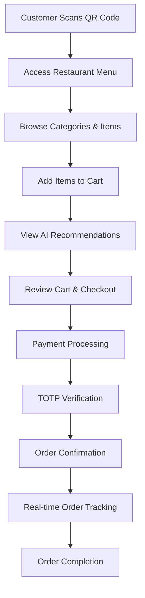
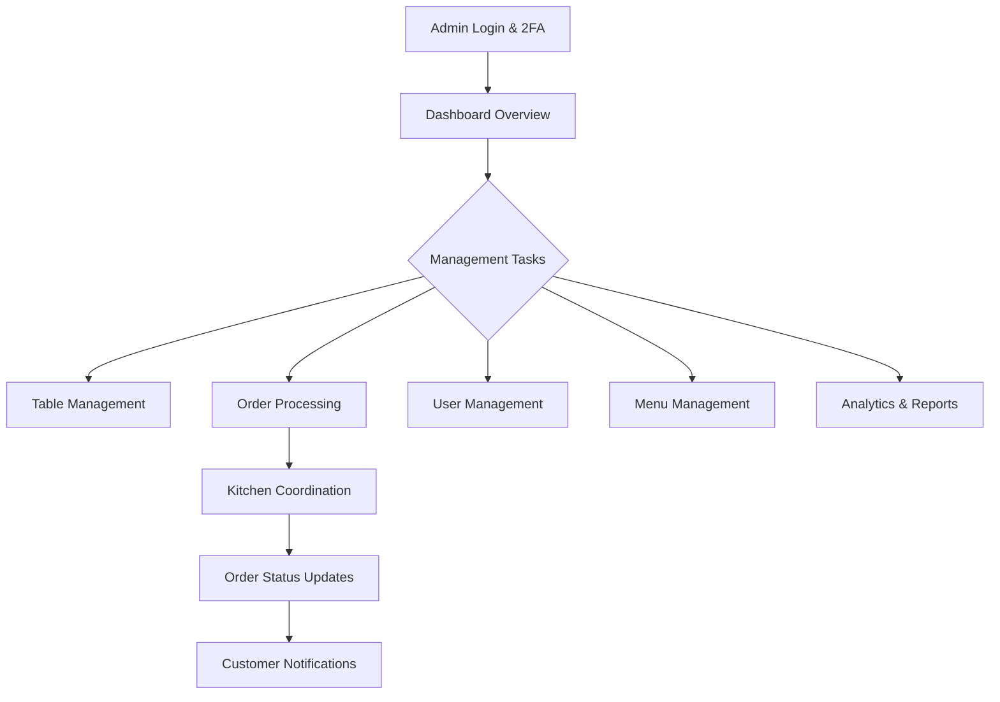
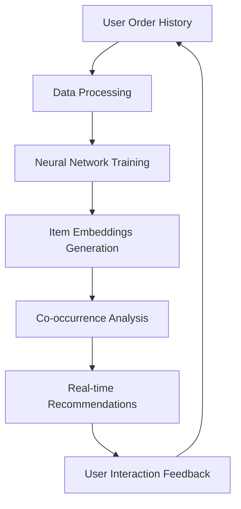

# 🍽️ FOOD DASH - QR-Based Restaurant Ordering System with AI Recommendations

A modern, full-stack restaurant ordering platform that revolutionizes dining experiences through QR code technology, real-time order management, and intelligent food recommendations powered by TensorFlow.js.

## 🌟 Overview

FOOD DASH is a comprehensive restaurant management and ordering system that allows customers to scan QR codes at tables, browse menus, place orders, and receive personalized food recommendations. The system includes a powerful admin dashboard for restaurant management and real-time order tracking.

## 🚀 Key Features

### 🎯 Customer-Facing Features
- **QR Code Table Ordering**: Scan table QR codes to access restaurant menu and place orders
- **Smart Food Recommendations**: AI-powered suggestions based on cart items and user preferences
- **Real-time Order Tracking**: Live updates on order status with TOTP verification
- **Secure Authentication**: Google OAuth integration and JWT-based authentication
- **Interactive Cart Management**: Add, remove, and modify items with real-time total calculation
- **Payment Integration**: Secure payments through Razorpay gateway
- **Responsive Design**: Beautiful, modern UI that works on all devices

### 🛠️ Admin Management Features
- **Comprehensive Dashboard**: Real-time analytics and system monitoring
- **Table Management**: Create, update, and monitor restaurant tables with QR codes
- **User Management**: Customer account oversight and management
- **Session Management**: Active user session monitoring and control
- **Order Management**: Real-time order processing and kitchen coordination
- **Menu Management**: Dynamic menu item creation and updates
- **Payment & Billing**: Transaction monitoring and financial reporting
- **Kitchen Management**: Order queue management and preparation tracking

### 🤖 AI-Powered Recommendations
- **Collaborative Filtering**: Neural network-based recommendations using TensorFlow.js
- **Real-time Learning**: Continuous model improvement based on user behavior
- **Content-based Filtering**: Recommendations based on item features and categories
- **Smart Fallbacks**: Popular items when insufficient data is available
- **Admin Analytics**: Performance monitoring and recommendation insights

## 🏗️ Architecture & Technology Stack

### Backend (Node.js/Express)
```
📦 Server Architecture
├── 🔐 Authentication & Security
│   ├── JWT Token Management
│   ├── Google OAuth Integration
│   ├── Redis Rate Limiting
│   └── Helmet Security Headers
├── 📊 Database Layer (MongoDB)
│   ├── User Management
│   ├── Order Processing
│   ├── Recommendation Engine Data
│   └── Session Management
├── 🤖 AI Recommendation Engine
│   ├── TensorFlow.js Neural Networks
│   ├── Collaborative Filtering
│   └── Real-time Model Training
├── 🔄 Real-time Communication
│   ├── Socket.IO WebSocket Server
│   ├── Order Status Broadcasting
│   └── Admin Dashboard Updates
└── 💳 Payment Processing
    └── Razorpay Integration
```

### Frontend (React/Vite)
```
📦 Client Architecture
├── 🎨 Modern UI Framework
│   ├── React 18 with Hooks
│   ├── Radix UI Components
│   ├── Tailwind CSS Styling
│   └── Framer Motion Animations
├── 🛣️ Routing & Navigation
│   ├── React Router DOM
│   ├── Protected Route Guards
│   └── Role-based Access Control
├── 📱 State Management
│   ├── Context API for Auth
│   ├── Cart State Management
│   └── Real-time Socket Updates
└── 📸 Advanced Features
    ├── QR Code Scanner
    ├── File Upload Handling
    └── Real-time Notifications
```

## 🔄 Application Flow

### Customer Journey


### Admin Workflow


### AI Recommendation Engine Flow


## 📁 Project Structure

```
food-dash/
├── 📁 server/                          # Backend API Server
│   ├── 📁 controllers/                 # Business Logic Controllers
│   │   ├── admin-controller.js         # Admin management logic
│   │   ├── auth-controller.js          # Authentication handling
│   │   ├── order-controller.js         # Order processing logic
│   │   ├── recommendation-controller.js # AI recommendation logic
│   │   └── payment-controller.js       # Payment processing
│   ├── 📁 database/                    # Database Configuration
│   │   ├── 📁 models/                  # MongoDB Schema Models
│   │   │   ├── user-model.js           # User data schema
│   │   │   ├── order-model.js          # Order data schema
│   │   │   ├── recommendation-model.js  # AI model data schema
│   │   │   └── admin-model.js          # Admin user schema
│   │   └── db.js                       # Database connection
│   ├── 📁 routes/                      # API Route Definitions
│   │   ├── auth-router.js              # Authentication routes
│   │   ├── order-router.js             # Order management routes
│   │   ├── recommendation-router.js     # AI recommendation routes
│   │   └── admin-router.js             # Admin panel routes
│   ├── 📁 middlewares/                 # Custom Middleware
│   │   └── error-middleware.js         # Error handling
│   ├── 📁 utils/                       # Utility Functions
│   │   ├── recommendation-engine.js     # TensorFlow.js AI engine
│   │   └── logger.js                   # Logging utility
│   ├── 📁 validators/                  # Input Validation
│   └── server.js                       # Main server entry point
├── 📁 client/                          # Frontend React Application
│   ├── 📁 src/
│   │   ├── 📁 components/              # Reusable UI Components
│   │   │   ├── 📁 Layout/              # Navigation & Layout
│   │   │   ├── 📁 ui/                  # Base UI Components
│   │   │   ├── 📁 client/              # Customer-facing components
│   │   │   └── 📁 admin/               # Admin panel components
│   │   ├── 📁 pages/                   # Page Components
│   │   │   ├── 📁 client/              # Customer pages
│   │   │   │   ├── Home.jsx            # Landing page
│   │   │   │   ├── Qr.jsx              # QR scanner page
│   │   │   │   ├── Cart.jsx            # Shopping cart
│   │   │   │   ├── Login.jsx           # User authentication
│   │   │   │   └── Order-Success.jsx   # Order confirmation
│   │   │   └── 📁 admin/               # Admin pages
│   │   │       ├── Admin-Home.jsx      # Admin dashboard
│   │   │       ├── Table-Management.jsx # Table management
│   │   │       ├── User-Management.jsx  # User management
│   │   │       └── Order-Management.jsx # Order management
│   │   ├── 📁 store/                   # State Management
│   │   │   ├── auth.jsx                # Authentication context
│   │   │   └── cart.jsx                # Cart state management
│   │   ├── 📁 hooks/                   # Custom React Hooks
│   │   ├── 📁 lib/                     # Utility Libraries
│   │   ├── App.jsx                     # Main App component
│   │   └── main.jsx                    # React entry point
│   ├── index.html                      # HTML entry point
│   ├── package.json                    # Frontend dependencies
│   └── vite.config.js                  # Vite configuration
├── RECOMMENDATION_SYSTEM.md            # AI system documentation
├── .gitignore                          # Git ignore rules
└── README.md                           # This file
```

## 🛠️ Installation & Setup

### Prerequisites
- **Node.js** (v16 or higher)
- **MongoDB** (v4.4 or higher)
- **Redis** (v6 or higher)
- **npm** or **yarn**

### Environment Variables

Create `.env` files in both server and client directories:

#### Server (.env)
```env
# Database
MONGODB_URI=mongodb://localhost:27017/fooddash
REDIS_URL=redis://localhost:6379

# Authentication
JWT_SECRET=your_jwt_secret_key
ADMIN_JWT_SECRET=your_admin_jwt_secret

# Google OAuth
GOOGLE_CLIENT_ID=your_google_client_id
GOOGLE_CLIENT_SECRET=your_google_client_secret

# Payment Gateway
RAZORPAY_KEY_ID=your_razorpay_key_id
RAZORPAY_KEY_SECRET=your_razorpay_key_secret

# Server Configuration
PORT=5000
NODE_ENV=development
```

#### Client (.env)
```env
VITE_API_URL=http://localhost:5000
VITE_GOOGLE_CLIENT_ID=your_google_client_id
VITE_RAZORPAY_KEY_ID=your_razorpay_key_id
```

### Installation Steps

1. **Clone the Repository**
```bash
git clone <repository-url>
cd food-dash
```

2. **Install Backend Dependencies**
```bash
cd server
npm install
```

3. **Install Frontend Dependencies**
```bash
cd ../client
npm install
```

4. **Start the Development Environment**

Terminal 1 (Backend):
```bash
cd server
npm run dev
```

Terminal 2 (Frontend):
```bash
cd client
npm run dev
```

5. **Access the Application**
- **Frontend**: http://localhost:5173
- **Backend API**: http://localhost:5000

## 📋 API Documentation

### Authentication Endpoints
```http
POST /api/auth/register          # User registration
POST /api/auth/login             # User login
POST /api/auth/google-auth       # Google OAuth login
POST /api/auth/logout            # User logout
GET  /api/auth/verify-token      # Token verification
```

### Order Management
```http
POST /api/order/create           # Create new order
GET  /api/order/user/:userId     # Get user orders
PUT  /api/order/:orderId/status  # Update order status
GET  /api/order/:orderId         # Get specific order
```

### Recommendation System
```http
POST /api/recommendations/cart   # Get cart-based recommendations
GET  /api/recommendations/popular # Get popular items
GET  /api/recommendations/user   # Get personalized recommendations
POST /api/recommendations/retrain # Retrain AI model (admin)
```

### Admin Management
```http
GET  /api/admin/dashboard        # Dashboard analytics
GET  /api/admin/users            # User management
GET  /api/admin/orders           # Order management
POST /api/admin/tables           # Table creation
PUT  /api/admin/tables/:id       # Table updates
```

### Payment Processing
```http
POST /api/payment/create-order   # Create payment order
POST /api/payment/verify         # Verify payment
GET  /api/payment/history        # Payment history
```

## 🎯 Usage Guide

### For Customers

1. **Scan QR Code**: Use your phone camera to scan the table QR code
2. **Browse Menu**: Explore categories and view item details
3. **Add to Cart**: Select items and quantities
4. **View Recommendations**: Check AI-suggested items based on your cart
5. **Checkout**: Review order and proceed to payment
6. **Payment**: Complete secure payment via Razorpay
7. **Verification**: Enter TOTP code for order confirmation
8. **Track Order**: Monitor real-time order status updates

### For Restaurant Staff

1. **Admin Login**: Access admin panel with secure credentials
2. **Two-Factor Authentication**: Complete TOTP verification
3. **Dashboard**: Monitor real-time analytics and metrics
4. **Manage Tables**: Create/update table QR codes
5. **Process Orders**: Handle incoming orders and update status
6. **Kitchen Coordination**: Manage order queue and preparation
7. **Customer Management**: Oversee user accounts and sessions
8. **Analytics**: Review performance reports and recommendations

## 🧠 AI Recommendation System

### How It Works

1. **Data Collection**: Analyzes order history and user behavior
2. **Neural Network Training**: Uses TensorFlow.js for collaborative filtering
3. **Real-time Inference**: Generates recommendations based on current cart
4. **Continuous Learning**: Improves accuracy with each interaction
5. **Personalization**: Adapts to individual user preferences

### Key Features

- **Multi-hot Encoding**: Efficient order data representation
- **Collaborative Filtering**: User-item interaction analysis
- **Content-based Filtering**: Item feature similarity
- **Hybrid Approach**: Combines multiple recommendation strategies
- **Real-time Updates**: Instant model retraining capabilities

## 🔧 Configuration Options

### Recommendation Engine Settings
```javascript
// In server/utils/recommendation-engine.js
const config = {
  embeddingDimension: 32,    // Vector size for items
  epochs: 50,                // Training iterations
  batchSize: 32,             // Training batch size
  learningRate: 0.001,       // Neural network learning rate
  dropoutRate: 0.3           // Regularization parameter
};
```

### Rate Limiting Configuration
```javascript
// In server/server.js
const rateLimiter = {
  points: 100,               // Requests per duration
  duration: 30,              // Time window (seconds)
  blockDuration: 15          // Block duration (minutes)
};
```

## 🚀 Production Deployment

### Backend Deployment
1. Set production environment variables
2. Configure MongoDB Atlas or production database
3. Set up Redis instance (AWS ElastiCache, etc.)
4. Deploy to cloud platform (AWS, Heroku, DigitalOcean)
5. Configure SSL certificates
6. Set up logging and monitoring

### Frontend Deployment
1. Build production bundle: `npm run build`
2. Deploy to CDN or static hosting (Vercel, Netlify)
3. Configure environment variables
4. Set up domain and SSL

### Performance Optimization
- Enable gzip compression
- Implement caching strategies
- Use CDN for static assets
- Database indexing optimization
- Image compression and optimization

## 🔒 Security Features

- **JWT Authentication**: Secure token-based authentication
- **Rate Limiting**: DDoS protection with Redis-based limiting
- **Input Validation**: Zod schema validation for all inputs
- **CORS Policy**: Configured cross-origin resource sharing
- **Helmet Security**: Security headers and protection
- **Password Hashing**: bcrypt encryption for passwords
- **Environment Variables**: Secure configuration management

## 🧪 Testing

### Backend Testing
```bash
cd server
npm test                     # Run unit tests
npm run test:integration     # Run integration tests
npm run test:coverage        # Test coverage report
```

### Frontend Testing
```bash
cd client
npm test                     # Run component tests
npm run test:e2e            # End-to-end tests
```

## 📊 Monitoring & Analytics

### Key Metrics Tracked
- **Order Conversion Rates**: Cart-to-order completion
- **Recommendation Performance**: Click-through rates
- **User Engagement**: Session duration and interactions
- **System Performance**: Response times and error rates
- **Business Metrics**: Revenue, popular items, peak hours

### Admin Dashboard Features
- Real-time order tracking
- Customer behavior analytics
- Recommendation system performance
- Revenue and sales reports
- System health monitoring

## 🤝 Contributing

1. Fork the repository
2. Create a feature branch: `git checkout -b feature/new-feature`
3. Make your changes and commit: `git commit -am 'Add new feature'`
4. Push to the branch: `git push origin feature/new-feature`
5. Submit a pull request

### Development Guidelines
- Follow ESLint configuration
- Write comprehensive tests
- Update documentation
- Use conventional commit messages
- Ensure code formatting with Prettier

## 🐛 Troubleshooting

### Common Issues

**Database Connection Failed**
- Verify MongoDB is running
- Check connection string in .env
- Ensure database permissions

**Redis Connection Error**
- Confirm Redis server is running
- Verify Redis URL configuration
- Check network connectivity

**Authentication Issues**
- Verify Google OAuth credentials
- Check JWT secret configuration
- Ensure cookie settings are correct

**Payment Gateway Errors**
- Validate Razorpay API keys
- Check webhook configurations
- Verify payment gateway settings

## 📚 Additional Resources

- [TensorFlow.js Documentation](https://www.tensorflow.org/js)
- [React Documentation](https://react.dev)
- [Express.js Guide](https://expressjs.com)
- [MongoDB Documentation](https://docs.mongodb.com)
- [Razorpay Integration Guide](https://razorpay.com/docs)

## 📄 License

This project is licensed under the MIT License - see the [LICENSE](LICENSE) file for details.

## 🙏 Acknowledgments

- TensorFlow.js team for the machine learning framework
- Radix UI for the component library
- Razorpay for payment processing
- MongoDB team for the database solution
- All contributors and maintainers

---

**Made with ❤️ for the future of restaurant technology**

For support or questions, please open an issue or contact the development team.