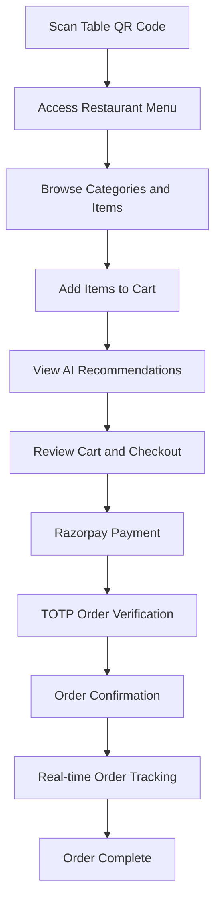
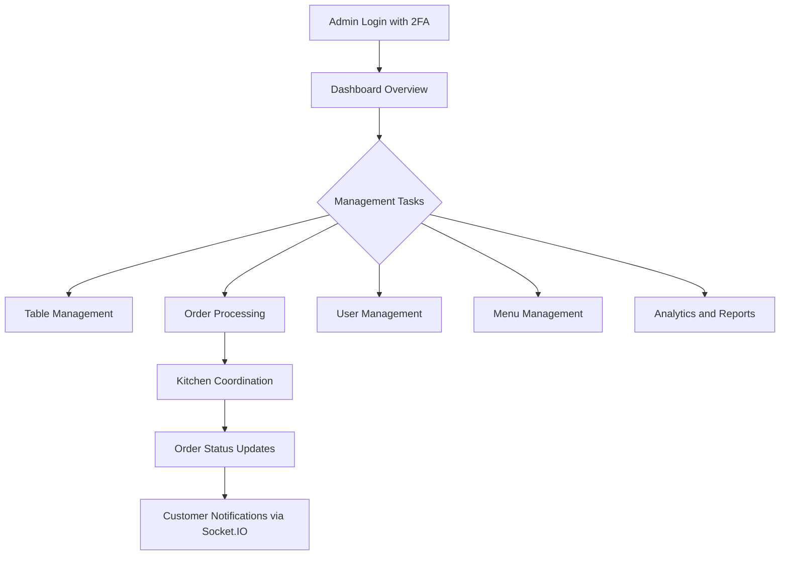
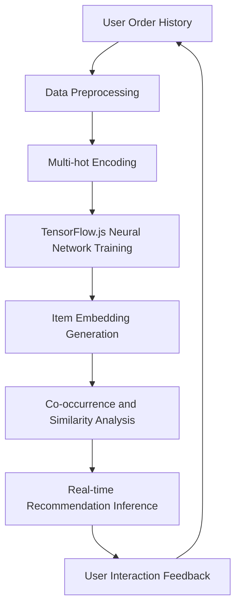
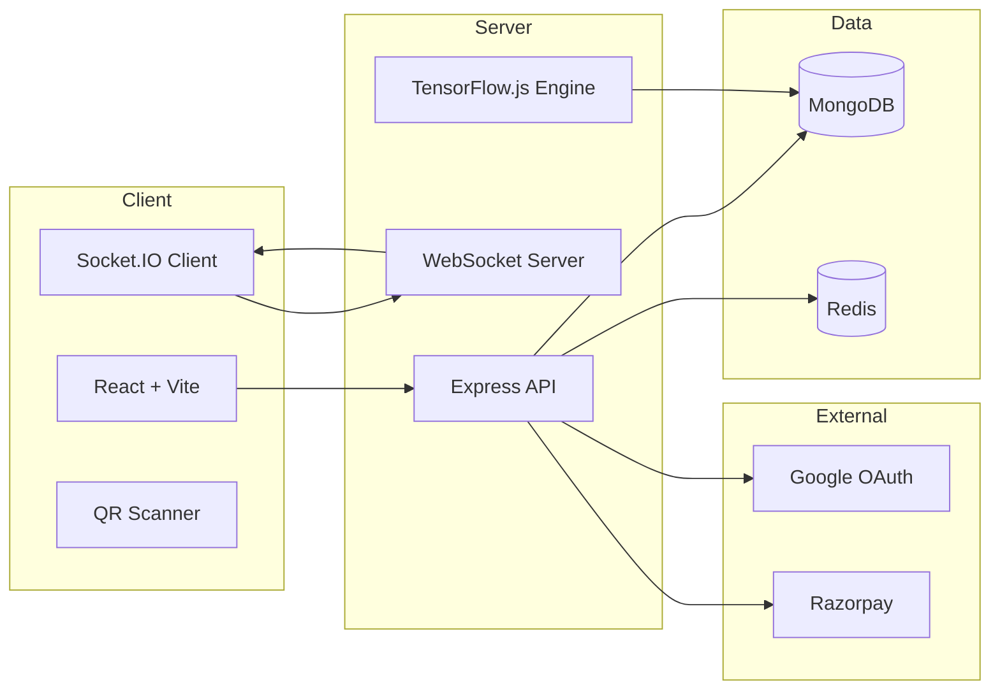

# FOOD DASH 
## Contactless Ordering System(TOTP) with AI-Based Menu Recommendations

A full-stack restaurant ordering platform built on QR code technology, real-time order management, and AI-powered food recommendations.

## Overview


FOOD DASH enables customers to scan table QR codes, browse menus, place orders, and receive personalized recommendations. Restaurant staff manage operations through a real-time admin dashboard covering orders, tables, menus, and payments.


## Key Features

### Customer-Facing
- QR code table scanning to access menus and place orders
- AI-powered food recommendations based on cart contents and order history
- Real-time order tracking with TOTP verification
- Google OAuth and JWT-based authentication
- Razorpay payment gateway integration
- Responsive UI across all device sizes

### Admin Management
- Real-time analytics dashboard
- Table creation and QR code generation
- Live order queue management and kitchen coordination
- Menu item creation and updates
- User account and session oversight
- Transaction monitoring and financial reporting

### AI Recommendation Engine
- Collaborative filtering via TensorFlow.js neural networks
- Content-based filtering on item features and categories
- Continuous model improvement from user interactions
- Popular item fallback when user history is insufficient


## Application Flow

### Customer Journey



### Admin Workflow



### AI Recommendation Engine



### System Architecture




## Technology Stack

### Backend
- Node.js with Express
- MongoDB for persistent storage
- Redis for rate limiting and session management
- Socket.IO for real-time communication
- TensorFlow.js for the recommendation engine
- Passport.js with Google OAuth
- Razorpay payment processing
- Zod input validation
- Helmet security headers

### Frontend
- React 18 with Hooks
- Vite build tooling
- Tailwind CSS
- Radix UI components
- Framer Motion animations
- React Router DOM with role-based guards
- Context API for auth and cart state


## Project Structure

```
food-dash/
├── server/
│   ├── controllers/
│   │   ├── admin-controller.js
│   │   ├── auth-controller.js
│   │   ├── order-controller.js
│   │   ├── recommendation-controller.js
│   │   └── payment-controller.js
│   ├── database/
│   │   ├── models/
│   │   │   ├── user-model.js
│   │   │   ├── order-model.js
│   │   │   ├── recommendation-model.js
│   │   │   └── admin-model.js
│   │   └── db.js
│   ├── routes/
│   │   ├── auth-router.js
│   │   ├── order-router.js
│   │   ├── recommendation-router.js
│   │   └── admin-router.js
│   ├── middlewares/
│   │   └── error-middleware.js
│   ├── utils/
│   │   ├── recommendation-engine.js
│   │   └── logger.js
│   ├── validators/
│   └── server.js
└── client/
    ├── src/
    │   ├── components/
    │   │   ├── Layout/
    │   │   ├── ui/
    │   │   ├── client/
    │   │   └── admin/
    │   ├── pages/
    │   │   ├── client/
    │   │   │   ├── Home.jsx
    │   │   │   ├── Qr.jsx
    │   │   │   ├── Cart.jsx
    │   │   │   ├── Login.jsx
    │   │   │   └── Order-Success.jsx
    │   │   └── admin/
    │   │       ├── Admin-Home.jsx
    │   │       ├── Table-Management.jsx
    │   │       ├── User-Management.jsx
    │   │       └── Order-Management.jsx
    │   ├── store/
    │   │   ├── auth.jsx
    │   │   └── cart.jsx
    │   ├── hooks/
    │   ├── lib/
    │   ├── App.jsx
    │   └── main.jsx
    ├── index.html
    ├── package.json
    └── vite.config.js
```


## Installation

### Prerequisites

- Node.js v16 or higher
- MongoDB v4.4 or higher
- Redis v6 or higher

### Environment Variables

#### `server/.env`

```env
MONGODB_URI=mongodb://localhost:27017/fooddash
REDIS_URL=redis://localhost:6379

JWT_SECRET=your_jwt_secret_key
ADMIN_JWT_SECRET=your_admin_jwt_secret

GOOGLE_CLIENT_ID=your_google_client_id
GOOGLE_CLIENT_SECRET=your_google_client_secret

RAZORPAY_KEY_ID=your_razorpay_key_id
RAZORPAY_KEY_SECRET=your_razorpay_key_secret

PORT=5000
NODE_ENV=development
```

#### `client/.env`

```env
VITE_API_URL=http://localhost:5000
VITE_GOOGLE_CLIENT_ID=your_google_client_id
VITE_RAZORPAY_KEY_ID=your_razorpay_key_id
```

### Setup

```bash
# Clone the repository
git clone <repository-url>
cd food-dash

# Install backend dependencies
cd server && npm install

# Install frontend dependencies
cd ../client && npm install
```

### Running in Development

```bash
# Terminal 1 — Backend
cd server && npm run dev

# Terminal 2 — Frontend
cd client && npm run dev
```

The frontend is available at `http://localhost:5173` and the API at `http://localhost:5000`.


## API Reference

### Authentication

| Method | Endpoint | Description |
|--------|----------|-------------|
| POST | `/api/auth/register` | Register a new user |
| POST | `/api/auth/login` | Login with credentials |
| POST | `/api/auth/google-auth` | Google OAuth login |
| POST | `/api/auth/logout` | Logout current user |
| GET | `/api/auth/verify-token` | Verify JWT token |

### Orders

| Method | Endpoint | Description |
|--------|----------|-------------|
| POST | `/api/order/create` | Create a new order |
| GET | `/api/order/user/:userId` | Get orders for a user |
| PUT | `/api/order/:orderId/status` | Update order status |
| GET | `/api/order/:orderId` | Get a specific order |

### Recommendations

| Method | Endpoint | Description |
|--------|----------|-------------|
| POST | `/api/recommendations/cart` | Get cart-based recommendations |
| GET | `/api/recommendations/popular` | Get popular items |
| GET | `/api/recommendations/user` | Get personalized recommendations |
| POST | `/api/recommendations/retrain` | Retrain the AI model (admin only) |

### Admin

| Method | Endpoint | Description |
|--------|----------|-------------|
| GET | `/api/admin/dashboard` | Dashboard analytics |
| GET | `/api/admin/users` | List all users |
| GET | `/api/admin/orders` | List all orders |
| POST | `/api/admin/tables` | Create a table |
| PUT | `/api/admin/tables/:id` | Update a table |

### Payments

| Method | Endpoint | Description |
|--------|----------|-------------|
| POST | `/api/payment/create-order` | Create a Razorpay order |
| POST | `/api/payment/verify` | Verify a payment |
| GET | `/api/payment/history` | Get payment history |

> [!NOTE]
> Full user API documentation: [user-api-documentation.md](/user-api-documentation.md)


## Configuration

### Recommendation Engine

```javascript
// server/utils/recommendation-engine.js
const config = {
  embeddingDimension: 32,
  epochs: 50,
  batchSize: 32,
  learningRate: 0.001,
  dropoutRate: 0.3
};
```

### Rate Limiting

```javascript
// server/server.js
const rateLimiter = {
  points: 100,        // requests per window
  duration: 30,       // window in seconds
  blockDuration: 15   // block duration in minutes
};
```

> [!NOTE]
> Full recommendation engine documentation: [recommendation-engine.md](/recommendation-engine.md)


## Security

- JWT and session-based authentication with role separation (user vs admin)
- Redis-backed rate limiting for DDoS mitigation
- Zod schema validation on all inputs
- Helmet for HTTP security headers
- bcrypt password hashing
- CORS policy enforcement
- Environment-variable-based secrets management


## Deployment

### Backend

1. Set all production environment variables
2. Provision a MongoDB Atlas cluster or self-hosted MongoDB instance
3. Provision a managed Redis instance
4. Deploy to your cloud platform of choice
5. Configure SSL and a reverse proxy (e.g., Nginx)

### Frontend

```bash
cd client && npm run build
```

Deploy the `dist/` directory to any static hosting provider. Set the `VITE_API_URL` environment variable to point to the production API.


## Troubleshooting

**MongoDB connection fails** — Verify the service is running and `MONGODB_URI` is correct. Check that the database user has the required permissions.

**Redis connection error** — Confirm Redis is running and `REDIS_URL` matches. Check for network or firewall rules blocking the port.

**Authentication issues** — Double-check `GOOGLE_CLIENT_ID`, `GOOGLE_CLIENT_SECRET`, and `JWT_SECRET`. Confirm OAuth redirect URIs are registered in Google Cloud Console.

**Payment gateway errors** — Validate `RAZORPAY_KEY_ID` and `RAZORPAY_KEY_SECRET`. Ensure webhook endpoints are publicly accessible and correctly configured in the Razorpay dashboard.


## Contributing

1. Fork the repository
2. Create a feature branch: `git checkout -b feature/your-feature`
3. Commit your changes: `git commit -m 'feat: add your feature'`
4. Push to the branch: `git push origin feature/your-feature`
5. Open a pull request

Follow the existing ESLint and Prettier configuration. Write tests for new functionality and use conventional commit messages.


## License

This project is licensed under the MIT License. See the [LICENSE](LICENSE) file for details.
