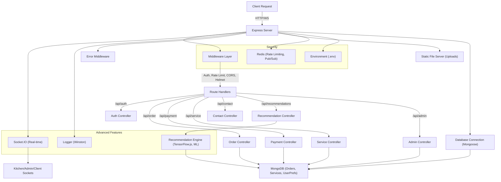
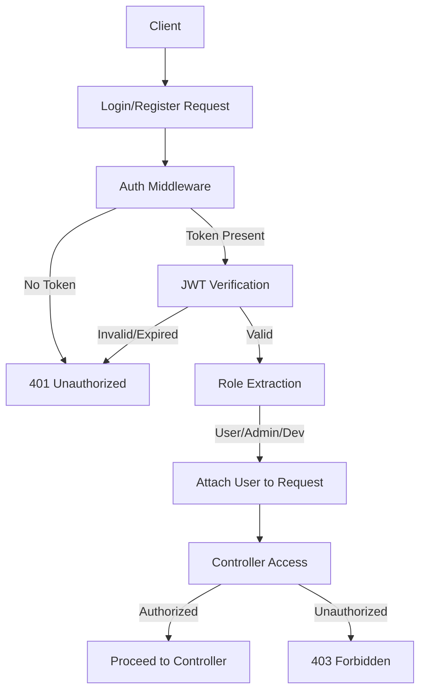
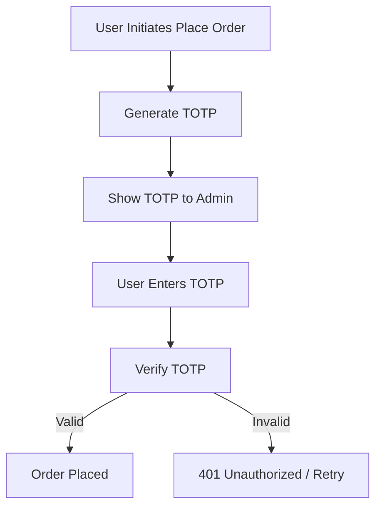
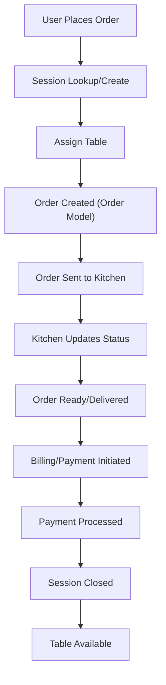

# Restaurant QR Order System – Backend (Server)

---

## 🚀 Technology Stack

- **Node.js** (Express.js 5.x)
- **MongoDB** (Mongoose ODM)
- **Redis** (Rate limiting, Pub/Sub, Caching)
- **Socket.IO** (Real-time communication)
- **TensorFlow.js** (Machine Learning for Recommendations)
- **Winston** (Advanced Logging)
- **Bull** (Job Queue)
- **Razorpay** (Payments)
- **Helmet, CORS, Rate Limiting** (Security)
- **Zod** (Validation)

---

## 🏗️ High-Level Architecture

- **Express.js** server orchestrates all HTTP and WebSocket traffic.
- **Modular Controllers** for business logic: Auth, Order, Payment, Service, Contact, Recommendation, Admin, Kitchen, Developer.
- **Middleware Layer** for authentication, validation, error handling, rate limiting, and security.
- **MongoDB** for persistent storage (users, orders, services, recommendations, etc.).
- **Redis** for rate limiting, pub/sub, and caching.
- **Socket.IO** for real-time updates (kitchen, admin, client notifications).
- **TensorFlow.js** powers a custom recommendation engine (hybrid ML + statistics).
- **Winston** for multi-level, persistent logging.

---

## 🔥 Advanced Features

- **Hybrid Recommendation Engine**: Neural network (TensorFlow.js) + co-occurrence statistics for personalized, real-time menu recommendations.
- **Real-Time Operations**: Order status, kitchen updates, and admin actions via Socket.IO.
- **Enterprise Security**: JWT authentication, role-based access, helmet, CORS, Redis-backed rate limiting, and DDoS protection.
- **Robust Logging**: Winston logs to file and console, with error, warn, info, and debug levels, plus exception/rejection handling.
- **Scalable Uploads**: Static file serving for media (images, videos) with CORS and content-type headers.
- **Job Queues**: Bull for background processing (future-proofed).

---

## 🔄 Request/Response Flow

1. **Client** sends HTTP/WS request.
2. **Express Server** receives and passes through middleware:
   - Security (Helmet, CORS)
   - Rate Limiting (Redis)
   - Authentication (JWT, role-based)
   - Validation (Zod)
   - Logging (Winston)
3. **Route Handlers** dispatch to appropriate controller (e.g., /api/order → Order Controller).
4. **Controllers** execute business logic, interact with MongoDB (via Mongoose models), Redis, or external APIs (e.g., Razorpay).
5. **Recommendation Controller** invokes the ML engine for personalized suggestions.
6. **Socket.IO** emits/receives real-time events (order status, kitchen, admin, etc.).
7. **Error Middleware** catches and formats all errors for the client.
8. **Logger** records all actions, errors, and warnings.

---

## 🗄️ Database & Models

- **MongoDB** (via Mongoose):
  - **User, Admin, Developer**: Authentication, roles, preferences
  - **Order, Session, Table**: Order lifecycle, session management, table status
  - **Service**: Menu items, categories, attributes
  - **Recommendation**: Item embeddings, co-occurrence, user preferences, model metadata
  - **Payment**: Payment status, Razorpay integration
  - **Contact, PasswordToken**: Support, password reset

---

## 🛡️ Security & Error Handling

- **JWT Authentication**: Role-based (user, admin, developer)
- **Rate Limiting**: Redis-backed, global and sensitive endpoint protection
- **Helmet**: HTTP header hardening
- **CORS**: Strict origin policy
- **Error Middleware**: Centralized error formatting (including file upload errors)
- **Logging**: All errors, warnings, and info are logged persistently

---

## 🤖 Recommendation Engine (Advanced)

- **Hybrid ML + Statistics**: Combines neural network (TensorFlow.js) with co-occurrence analysis for robust recommendations
- **Training**: Learns from 6 months of order history, updates embeddings and co-occurrence stats
- **Personalization**: User preferences (diet, price, favorites) influence recommendations
- **Real-Time**: Generates suggestions instantly as cart changes
- **Fallback**: Uses co-occurrence if ML model is unavailable
- **Model Metadata**: Tracks version, training data, and status

---

## 📈 Backend Working Flowchart

---

## 🧩 Controller Features Flowchart

This diagram illustrates the main features and data flows for each backend controller:

```mermaid
flowchart TD
  subgraph Controllers
    A1["Auth Controller"]
    A2["Order Controller"]
    A3["Payment Controller"]
    A4["Service Controller"]
    A5["Contact Controller"]
    A6["Recommendation Controller"]
    A7["Admin Controller"]
    A8["Kitchen Controller"]
    A9["Developer Controller"]
  end
  A1 -->|"Login/Register"| B1["JWT Generation"]
  A1 -->|"TOTP"| B2["2FA Verification"]
  A2 -->|"Create/Update/Track Orders"| B3["Order Model"]
  A2 -->|"Session/Table"| B4["Session/Table Model"]
  A3 -->|"Initiate/Verify Payment"| B5["Razorpay API"]
  A3 -->|"Billing"| B6["Payment Model"]
  A4 -->|"Menu CRUD"| B7["Service Model"]
  A5 -->|"Contact/Support"| B8["Contact Model"]
  A6 -->|"Get Recommendations"| B9["Recommendation Engine"]
  A6 -->|"User Preferences"| B10["UserPreference Model"]
  A7 -->|"User/Table Management"| B11["Admin/Session/Table Models"]
  A7 -->|"Analytics"| B12["Stats/Logs"]
  A8 -->|"Kitchen Updates"| B13["Socket.IO Events"]
  A9 -->|"Dev Tools"| B14["Developer Model"]
```

---

## 🔐 Authentication Flowchart

This diagram shows the authentication and authorization process for all protected routes:

---

## 🧩 How Everything Works Together

- **Client** interacts via HTTP or WebSocket.
- **Express** applies security, validation, and logging middleware.
- **Controllers** handle business logic, interact with MongoDB, Redis, and external APIs.
- **Recommendation Engine** provides ML-powered suggestions, updating in real-time.
- **Socket.IO** ensures real-time updates for kitchen, admin, and client.
- **Winston** logs all actions, errors, and warnings for audit and debugging.
- **Error Middleware** ensures all errors are handled gracefully and securely.
- **Redis** supports rate limiting, pub/sub, and caching for scalability.

---

## 📚 For Developers

- **Entry Point**: `server.js`
- **Environment**: Configure `.env` with MongoDB, Redis, JWT, and other secrets
- **Run**: `npm run dev` or `npm start`
- **Extend**: Add new controllers/routes in `controllers/` and `routes/`
- **Recommendation Engine**: See `utils/recommendation-engine.js` for ML logic
- **Logging**: See `utils/logger.js` for log configuration
- **Database Models**: See `database/models/`

--

## 🔑 TOTP Order Placement Flow

TOTP (Time-based One-Time Password) is used only for order placement. When a user places an order, a TOTP is generated and shown to both the user and the admin. The order is only placed after the user enters the correct TOTP for verification.

---

## 🍽️ Order Session Flow

This diagram illustrates the full order lifecycle, including session and table management:

---

*This backend is designed for scalability, security, and advanced personalization, leveraging modern Node.js, ML, and real-time technologies.*

---
